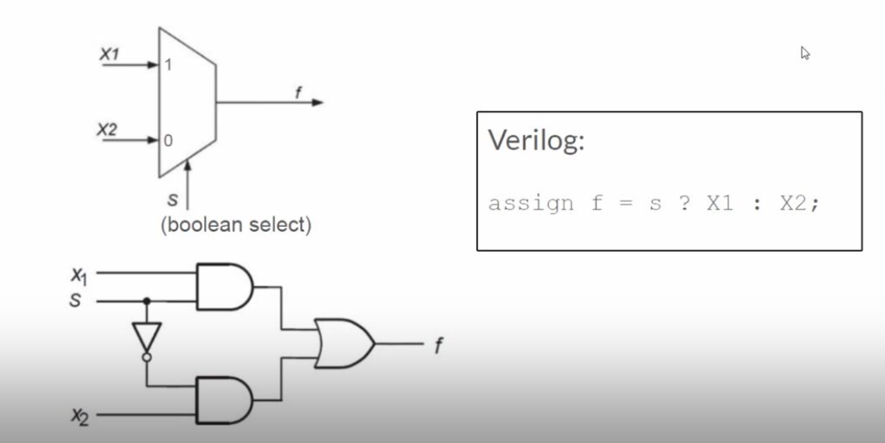
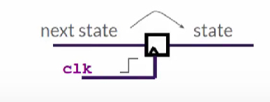

# Risc-V Based Myth - Day 3
Day 3 of the workshop conducted by kunal ghosh and steve hoover.
## TL- verilog
It stands for Transaction level verilog, it is an extended library of verilog itself with advanced functionalities like validity checking.
## Combinational Logic
They doesnt have memory or clock signa. Present state is a function of current inputs.

### Basic Combinational Elements
#### Logic gates
These are basic logic gates out of which all the big circuits are made. Out of these all **NAND** and **NOR** is called universal gates since all other gates can be built from them alone. 


#### MUX - Multiplexer
These are simple element having a select line and input. There can be any number of inputs but output will always be any one of them. We can select any one input line using the select line.

**With n select lines we can select 2^n input lines**



## Sequential Logic
They have clock and memoy, the present state is a fucntion of one or more previous states. 

### Basic Sequential Elements
#### Flip Flop
flip flops and latches are basic components in digital circuit. Out of that D-flipflop is the widely used and simplest Flipflop. They are edge triggered . Depending on the type of it we can classify them into two that is **positive edge triggered** and **negative edge triggered**



Here is how Combinational circuits can be used along with sequntial circuits to build practical useful devices


## Pipeline
We can split the code into different parts or pipes to have some timing benefits and adjustments.
## Validity
Valid conditions can be checked before executing a parrt of the code. and the code will be executed if and only if the condition is satisfied.

### Benefits of validity
Easier to debug
Clock gating
Better and cleaner design
Better Error checking

## Lab Codes And Screenshots
### Fibonacci 


### Free Running Counter

### Error

### Calculator Validity

```bash
\m5_TLV_version 1d: tl-x.org
\m5
   
   // =================================================
   // Welcome!  New to Makerchip? Try the "Learn" menu.
   // =================================================
   
   //use(m5-1.0)   /// uncomment to use M5 macro library.
\SV
   // Macro providing required top-level module definition, random
   // stimulus support, and Verilator config.
   m5_makerchip_module   // (Expanded in Nav-TLV pane.)
\TLV
   
   |calc
      ?$valid_or_reset
         @1
            $reset = *reset ;
            $val2[31:0] = $rand2[3:0] ;
            $op[1:0] = $rand3[1:0];
            $val1[31:0] = >>2$out ;
            $diff[31:0] = $val2 - $val1;
            $sum[31:0] = $val2 + $val1;
            $prod[31:0] = $val2 * $val1;
            $quot[31:0] = $val2 / $val1;
            $reset_output = 32'b0;
            $valid = $reset ? 0 : (1+>>1$cnt) ;
            $valid_or_reset = $reset | !$valid ;
         @2
            $out[31:0] = ($op[0] ? ($op[1] ? $quot : $prod):($op[0] ? $diff : $sum));
\SV
   endmodule

```
### Calculator Sequential 

```bash
\m5_TLV_version 1d: tl-x.org
\m5
   
   // =================================================
   // Welcome!  New to Makerchip? Try the "Learn" menu.
   // =================================================
   
   //use(m5-1.0)   /// uncomment to use M5 macro library.
\SV
   // Macro providing required top-level module definition, random
   // stimulus support, and Verilator config.
   m5_makerchip_module   // (Expanded in Nav-TLV pane.)
\TLV
   |calc
      @1
         $reset = *reset ;
         $val2[31:0] = $rand2[3:0] ;
         $op[1:0] = $rand3[1:0];
         $count[3:0] = $reset ? 0 : >>1$out;
         $val1[31:0] = $count ;
         $diff[31:0] = $val2 - $val1;
         $sum[31:0] = $val2 + $val1;
         $prod[31:0] = $val2 * $val1;
         $quot[31:0] = $val2 / $val1;
         $reset_output = 32'b0;
         $out[31:0] = $reset ? $reset_output : ($op[0] ? ($op[1] ? $quot : $prod):($op[0] ? $diff : $sum));
         $cnt[31:0] = $reset ? 0 : (1+>>1$cnt) ;
\SV
   endmodule

```
### Combinational Calculator


### Sequential Calculator With Counter


###  Cycle 2 Calculator


```bash
\m5_TLV_version 1d: tl-x.org
\m5
   
   // =================================================
   // Welcome!  New to Makerchip? Try the "Learn" menu.
   // =================================================
   
   //use(m5-1.0)   /// uncomment to use M5 macro library.
\SV
   // Macro providing required top-level module definition, random
   // stimulus support, and Verilator config.
   m5_makerchip_module   // (Expanded in Nav-TLV pane.)
\TLV
   $reset = *reset ;
   $val2[31:0] = $rand2[3:0] ;
   $op[1:0] = $rand3[1:0];
   |calc
      @1
         $reset = *reset ;
         $val2[31:0] = $rand2[3:0] ;
         $op[1:0] = $rand3[1:0];
         $count[3:0] = $reset ? 0 : >>2$out;
         $val1[31:0] = $count ;
         $diff[31:0] = $val2 - $val1;
         $sum[31:0] = $val2 + $val1;
         $prod[31:0] = $val2 * $val1;
         $quot[31:0] = $val2 / $val1;
         $reset_output = 32'b0;
         $valid = $reset ? 0 : (1+>>1$cnt) ;
      @2
         $out[31:0] = ($reset | !$valid) ? $reset_output : ($op[0] ? ($op[1] ? $quot : $prod):($op[0] ? $diff : $sum));
\SV
   endmodule

```
### Calculator With Memmory


```bash
\m5_TLV_version 1d: tl-x.org
\m5
   
   // =================================================
   // Welcome!  New to Makerchip? Try the "Learn" menu.
   // =================================================
   
   //use(m5-1.0)   /// uncomment to use M5 macro library.
\SV
   // Macro providing required top-level module definition, random
   // stimulus support, and Verilator config.
   m5_makerchip_module   // (Expanded in Nav-TLV pane.)
\TLV
   
   |calc
      @0
         $reset = *reset ;
      @1
         $val2[31:0] = $rand2[3:0] ;
         $val1[31:0] = >>2$out ;
         $valid = $reset ? '0 : (1+>>1$valid) ;
         $valid_or_reset = $reset || !$valid ;
      ?$valid_or_reset
         @1
            $diff[31:0] = $val2 - $val1;
            $sum[31:0] = $val2 + $val1;
            $prod[31:0] = $val2 * $val1;
            $quot[31:0] = $val2 / $val1;

         @2
            $mem[31:0] = $reset ? '0 : ($op[2:0] == 3'b101) ? $val1 : >>2$mem;
            $out[31:0] = $reset ? '0 :
                        ($op[2:0] == 3'b000) ? $sum :
                        ($op[2:0] == 3'b001) ? $diff :
                        ($op[2:0] == 3'b010) ? $prod :
                        ($op[2:0] == 3'b011) ? $quot :
                        ($op[2:0] == 3'b100) ? >>2$mem :>>2$out;
            
            

\SV
   endmodule

            
```
### Total Distance Code

```bash
\m5_TLV_version 1d: tl-x.org
\m5
   
   // =================================================
   // Welcome!  New to Makerchip? Try the "Learn" menu.
   // =================================================
   
   //use(m5-1.0)   /// uncomment to use M5 macro library.
\SV
   // Macro providing required top-level module definition, random
   // stimulus support, and Verilator config.
   m5_makerchip_module   // (Expanded in Nav-TLV pane.)
	include "sqrt32.v";
\TLV
   |calc
      @1
         $reset = *reset ;
      ?$valid
         @1
            $aa_sq[31:0] = $aa[3:0] ** 2 ;
            $bb_sq[31:0] = $bb[3:0] ** 2 ;
         @2
            $cc_sq[31:0] = $bb_sq + $aa_sq ;
         @3
            $cc[31:0] = sqrt($cc_sq);
      @4
         $tot_dist[63:0] =
            $reset ? 64'b0 :
               ( $valid ? (>>1$tot_dist + $cc) :
                  >>1$tot_dist);
      
      
\SV
   endmodule

```

